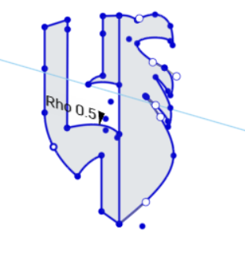

<p align="center">
  
</p>

<h1 align="center">Logo Design Using Onshape</h1>

<p align="center">
3D CAD Modeling • Sketch • Spline • Extrude
</p>

---

## 📖 Project Overview

This project demonstrates the process of designing a custom logo using Onshape. The model was created by drawing a 2D sketch, refining the geometry with spline curves and sketch tools, and converting it into a 3D model using the Extrude feature.

---

## 🛠️ Software

- Onshape

---

## 📐 Design Specifications

- Units: Millimeters (mm)
- Extrude Thickness: 2 mm
- Export Format: STL

---

## 🧰 CAD Tools Used

- Sketch
- Line
- Spline
- Arc
- Extrude

---

## 📸 Project Preview

### Sketch

<p align="center">
  
</p>

### 3D Model

<p align="center">
  
</p>

---

## 📂 Repository Structure

```text
LogoDesignUsingOnshape
│
├── image
│   ├── Sketch.png
│   ├── Final_Design.png
│   └── 3D_Model.png
│
├── Part Studio 1.stl
└── README.md
```

---

## ✅ Output

The logo was successfully modeled in Onshape using millimeter units (mm) and a 2 mm extrusion thickness. The final design was exported as an STL file for 3D printing and CAD applications.

---

## 👩🏻‍💻 Author

**Sama Alzahrani**
